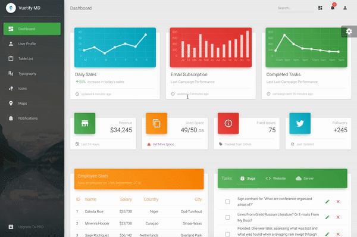

# nuxtjs-dashboard

> NuxtJs Dashboard is based on Vuetify Material Theme purposed by Creative Tim



## Demo / Presentation
[Live Demo !](https://nuxtjs-dashboard.herokuapp.com/)

NuxtJs Dashboard Vuetify Material is a beautiful resource built over [NuxtJs](https://nuxtjs.org/) coupled with [Vuetify](https://vuetifyjs.com/en/). It will help you get started developing dashboards in no time. 
This dashboard is the official Vuetify version of the Original [Material Dashboard](https://www.creative-tim.com/product/material-dashboard). Using the Dashboard is pretty simple but requires basic knowledge of [NuxtJs](https://nuxtjs.org/) and [Vuetify](https://vuetifyjs.com/en/).

## Getting started

``` bash
# install dependencies
$ npm install

# serve with hot reload at localhost:3000
$ npm run dev

# build for production and launch server
$ npm run build
$ npm start

# generate static project
$ npm run generate
```

## Building and running into containerized version

``` bash
# Build image
$ docker build -t nuxtjs-dashboard .

# Run image in detached mode
$ docker run -p 3000:3000 -d nuxtjs-dashboard

# Get container ID
$ docker ps

# Print application output (continuously)
$ docker logs <container id> -f

# Enter the container
$ docker exec -it <container id> /bin/bash

# Quit the container
$ docker stop <container id>
```


## NuxtJs
NuxtJs is a vue meta Framework to create complex, fast & universal web applications quickly.

## Vuetify
Vuetify is developed exactly according to Material Design spec. Every component is hand crafted to bring you the best possible UI tools to your next great app. The development doesn't stop at the core components outlined in Google's spec. Through the support of community members and sponsors, additional components will be designed and made available for everyone to enjoy.

#### Special thanks
- [NuxtJs](https://nuxtjs.org/) for the wonderful vue framework <3
- [Vuetify](https://vuetifyjs.com/en/) for the beautiful vue framework UI
- [Vuetify Material Theme](https://www.creative-tim.com/product/vuetify-material-dashboard?ref=vuetifyjs.com) for the beautiful work realized by [Creative Tim](https://www.creative-tim.com/)
